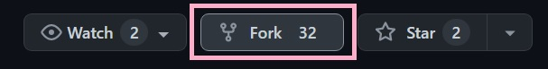
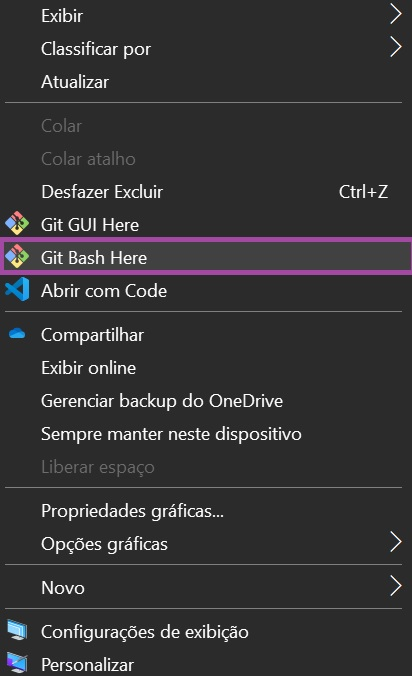

On14 - Backend {reprograma} 💜 API Saudex - Projeto Final 💜 Status: **concluído 💜** 

# <h1 align="center" style="font-weight: bold">API - Saudex</h1>

## **Sumário**

- [Origem da API Saudex](#origem-da-api-saudex)
- [Objetivo](#objetivo)
- [Funcionalidades](#funcionalidades)
- [Execução Saudex](#execução-saudex)
- [A Linguagem de Programação Executada](#a-linguagem-de-programação-executada)
- [Tecnologias Utilizadas](#tecnologias-utilizadas)
- [Bibliotecas Aplicadas](#bibliotecas-aplicadas)
- [Instruções de Instalação da API Saudex](#instruções-de-instalação-da-api-saudex)
- [Aprendizados](#aprendizados)
- [Portas](#portas)
- [Rotas Públicas](#rotas-públicas)
- [Rotas Privadas](#rotas-privadas)
- [Melhorias Futuras API Saudex](#melhorias-futuras-api-saudex)
- [Referências](#referências)
- [Agradecimentos](#agradecimentos)

 

 

## **Origem da API Saudex**
> O contexto geral sobre este projeto é extremamente revoltante e triste.

 

>  Durante anos houveram relatos não somente através do meu amigo Victor Soares, mas de outros cidadãos, sobre o descaso do Ministério da Saúde com as pessoas que fazem o uso de insulina e demais insumos gratuitos para gerar um controle maior sobre sua saúde e sua rotina diária.

 

> Com a chegada da Pandemia do Covid-19, consequentemente ocorreu um aumento nesses relatos.

 

> Entre os anos de 2020 à 2021, tive uma experiência pessoal negativa acompanhando o Victor Soares. Diabético, ele me informou que não havia conseguido adquirir fitas para medir sua glicose e não existia um aplicativo funcional ou gratuito para o auxiliar em como, por exemplo, encontrar médicos endocrinologistas, e essa situação se tornava frustrante, atrapalhava seu emocional, sua rotina e seu dia-dia, além do medo de ocorrer algo mais grave.

 

> Como se não bastasse, neste mesmo período perdi meu cunhado André Marcos, vítima de leucemia e minha prima Sabrina Thomaz, vítima da rejeição de um transplante de coração, sendo duas pessoas incríveis as quais desfrutei do prazer de conhecer, conviver... Infelizmente, nos deixaram cedo demais, são duas pessoas as quais viveram, amaram à vida cada segundo, aproveitaram todos os momentos. Duas pessoas guerreiras, duas pessoas fortes, que nos ensinaram muito. São duas pessoas as quais se estabeleceram em nossos corações e, com certeza, marcaram nossas almas e encontram-se para sempre em nossas memórias.

 

>  Como resultado deste período do ano de 2020 à 2021, nasceu o sentimento de impotência, o pesar em não ter a influência necessária para ajudar amenizar o sofrimento daqueles que amamos. Portanto, analisando tudo que aconteceu até o atual momento, realizei a criação da API Saudex, uma inspiração que surgiu através de dor e perda.

 

> O termo Saudex é formado pela junção da palavra saudade com a semelhança do fonema da palavra saúde.

 

# **Objetivo**

>  A API Saudex, possui como o seu principal objetivo a importância de ajudar pessoas diabéticas que fazem uso de insulinas e que tem a necessidade de insumos gratuitos.

 

>  Para atingirmos este objetivo, realizaremos os cadastros de Administradores, tornando-os administrantes da nossa API Saudex. Eles e serão capazes de realizar o login, gerando automaticamente um token ou chave e através deste, conseguirão registrar os Hospitais, Postos de Saúde e Farmácias, mas somente as que são credenciadas no “Programa Farmácia Popular”.

 

> Com os estabelecimentos referidos acima cadastrados em nosso banco de dados, os administrantes e usuários comuns terão a possibilidade de pesquisar pela nossa API Saudex, que informará onde encontrá-los no estado do Rio de Janeiro. A pesquisa poderá ser feita por município, por nome e por id, sendo que o último é obrigatório realização do login como administrador.

 

> Será possivel também encontrar médicos endocrinologistas, saber as quantidades de insumos disponíveis e informar as quantidades de senhas disponibilizadas para o atendimento.

 

> Em resumo, a Saudex foi desenvolvida com o propósito de indicar aos nossos usuários que sofrem com a diabetes em qual centro médico encontrar, primordialmente, médicos e insumos gratuitamente, que sejam mais próximo de sua residência entre outras finalidades.

 

 

## **Funcionalidades**

                                          Rotas Privadas

<h4 align="center" style="font-weight: bold"> {Administradores} </h4>

- [X] Cadastrar;
- [X] Atualizar;
- [X] Mostrar os registrados;
- [X] Pesquisar por id;
- [X] Logar;
- [X] Remover.

<h4 align="center" style="font-weight: bold"> {Postos de Saúde} </h4>

- [X] Cadastrar;
- [X] Atualizar;
- [X] Mostrar os registrados;
- [X] Pesquisar por id;
- [X] Pesquisar por nome;
- [X] Pesquisar por município;
- [X] Remover.

<h4 align="center" style="font-weight: bold"> {Hospitais} </h4>                               

- [X] Cadastrar;
- [X] Atualizar;
- [X] Mostrar os registrados;
- [X] Pesquisar por id;
- [X] Pesquisar por nome;
- [X] Pesquisar por município;
- [X] Remover.

<h4 align="center" style="font-weight: bold"> {Farmácias} </h4>

- [X] Cadastrar;
- [X] Atualizar;
- [X] Mostrar as registradas;
- [X] Pesquisar por id;
- [X] Pesquisar por nome;
- [X] Pesquisar por município;
- [X] Remover.

                                            Rotas Públicas
<h4 align="center" style="font-weight: bold"> {Saudex} </h4>

- [X] Pesquisar centros médicos que dispõe de endocrinologistas;
- [X] Pesquisar centros médicos que dispõe de insumos para diabetes;
- [X] Pesquisar quantidade de insumos para diabetes disponíveis nos Hospitais;
- [X] Pesquisar quantidade de insumos para diabetes disponíveis nos Postos de Saúde;
- [X] Pesquisar quantidade de senhas para atendimento nos Postos de Saúde;
- [X] Pesquisar quantidade de senhas para atendimento nos Hospitais;
- [X] Pesquisar Postos de Saúde por nome;
- [X] Pesquisar Hospitais por nome;
- [X] Pesquisar Farmácias por nome;
- [X] Pesquisar Postos de Saúde por município;
- [X] Pesquisar Hospitais por município;
- [X] Pesquisar Farmácias por município;
- [X] Mostrar Farmácias credenciadas no "Programa Farmácia Popular".

 

 

##  **Execução Saudex** 

 - Informando todos os centros médicos registrados. ✅ 

 -  Informando todas as farmácias registradas. ✅ 
 
 -  Informando todos os centros médicos que dispõe de médicos endocrinologistas. ✅
 
 - Informando todos os centros médicos que dispõe de insumos para diabetes. ✅

 
</img>

 

 

## **A Linguagem de Programação Executada**

 </img>

## **Tecnologias Utilizadas**
 

<a  href="https://git-scm.com/">
<a  href="https://nodejs.org/pt-br/">

## **Bibliotecas Aplicadas**
 

<a  href="https://www.npmjs.com/">
<a  href="https://expressjs.com/pt-br/">
<a  href="https://mongoosejs.com/">
<a  href="https://www.npmjs.com/package/dotenv-safe">
<a  href="https://www.npmjs.com/package/bcryptjs">
<a  href="https://www.npmjs.com/package/jsonwebtoken">

 

 

## **Instruções de Instalação da API Saudex** 

 Antes de começar, se for da sua preferência criar modificações em nosso código, será necessário realizar o download e concluir instalação do  <a href="https://code.visualstudio.com/download">Visual Studio Code</a> e <a href="https://nodejs.org/en/download/">Node.js.</a>
Para verificar se as modificações foram realizadas com sucesso, deixaremos o link para instalação de um banco de dados NoSQL, preferencialmente, o <a href="https://www.mongodb.com/try/download/community">MongoDB.</a>
Deixaremos disponíveis dois links de nossa preferência de APIs que serão capazes de testar, criar e comparatilhar APIs, são eles: o   <a href="https://www.postman.com/downloads/">Postman</a> e o </a>  <a href="https://insomnia.rest/download">Insomnia.</a>

**IMPORTANTE**: Sempre escolha versão de acordo com o seu sistema, não se esqueça!

Feito isto, siga o processo abaixo:

 - Faça um fork da API Saudex:

 
   

 - Na sua área de trabalho, clique no botão esquerdo do mouse ou no direito caso você seja canhota, abra o terminal git bash here:

 
   

- No terminal Git Bash Here, faça o clone da API Saudex:

      git clone https://github.com/letidesi/saudex.git

- Para os que desejam criar modificações no código, crie uma nova branch:

      git checkout -b nome-da-sua-branch

- (**Obs**: Se não deseja realizar modificações, apenas pule para próxima etapa)

- Entre na pasta da API Saudex:

      cd saudex

- Após entrar na pasta da API Saudex, instale todas as depedências:

      npm install ou npm i

- Depois de seguir este processo, você estará apto a executar nossa API, utilize o último comando para finalizar:

      npm start

- Os que fizeram modificações, realize o push das suas alterações e envie uma solicitação de pull request. Para mais informações de comandos, <a href="https://gist.github.com/letidesi/47454278dff1f7b666802f3cc4951292">clique aqui</a>.

 

 

## **Aprendizados**
 

 A construção deste projeto final, consiste nesta API fundamentada no CRUD com a integração do banco de dados NoSQL, o MongoDB. 
 
 

- Definindo o que é CRUD: 
    

      CREATE (CRIAR)
      READ (LER, CONSULTAR)
      UPDATE (ATUALIZAR) 
      DELETE (DESTRUIÇÃO, REMOÇÃO)

 

 

##  **Portas**

- Local: http://localhost:4000 - **Para rodar a API Saudex localmente**.

- Heroku: https://saudex-heroku.herokuapp.com/ - **Para consumir a API Saudex**.

 

 

##  **Rotas Públicas**

    Nome da rota principal = /saudex

|  **_{GET}_** | Retornar |
| ------------------- | :-------------------: |
| /                        | Mensagem principal de boas-vindas.  |
| /search/endocrinologists | Lista todos os Centros Médicos que possuem endocrinologistas disponíveis. |
| /search/supplies | Lista todos os Centros Médicos que possuem insumos disponíveis para pessoas diabéticas. |
| /search/healthpost/quantitysupplies | Lista todos os Postos de Saúdes que possuem a mesma quantidade de insumos informada pelo usuário. |
| /search/healthpost/attendancepassword | Lista todos os Postos de Saúdes que possuem a mesma quantidade de senha de atendimento informada pelo usuário. |
| /search/healthpost/name| Lista todos os Postos de Saúde que possuem o mesmo nome informado pelo usuário. |
| /search/hospital/quantitysupplies | Lista todos os Hospitais que possuem a mesma quantidade de insumos informada pelo usuário. |
| /search/hospital/attendancepassword | Lista todos os Hospitais que possuem a mesma quantidade de senha de atendimento informada pelo usuário.
| /search/hospital/name | Lista todos os Hospitais que possuem o mesmo nome informado pelo usuário. |
| /pharmacy/popularprogram | Lista todas as Farmácias que são credenciadas no "Programa Farmácia Popular". |
| /search/pharmacy/name| Lista todas as Farmácias que possuem o mesmo nome informado pelo usuário. |
| /search/healthpost/municipality | Lista todos os Postos de Saúde que estão localizados no mesmo município informado pelo usuário. |
| /search/hospital/municipality | Lista todos os Hospitais que estão localizados no mesmo município informado pelo usuário. |
| /search/pharmacy/municipality | Lista todos as Farmácias que estão localizados no mesmo município informado pelo usuário. |
| /all | Lista todos os centros médicos que foram registrados.

##  **Rotas Privadas**

     Nome da rota principal = /saudex
        

| **_{GET}_** | Retornar |
| ------------------- | :-------------------: |
| /message | Informar mensagem para administradores. |
| /adm | Lista todos os Admnistradores cadastrados. |
| /admin/:id | Procura o Admnistrador do id requisitado pelo Admnistrador logado.|
| /healthpost | Lista de todos os Postos de Saúde cadastrados. |
| /healthpost/search/name| Lista todos os Postos de Saúde que possuem o mesmo nome informado pelo administrante. |
| /healthpost/search/municipality | Lista todos os Postos de Saúde que estão localizados no mesmo município informado pelo administrante.  |
| /healthpost/search/:id | Procura o Posto de Saúde do id requisitado pelo administrante. |
| /hospital | Lista de todos os Hospitais cadastrados. |
| /hospital/search/name | Lista todos os Hospitais que possuem o mesmo nome informado pelo administrante. |
| /hospital/search/municipality | Lista todos os Hospitais que estão localizados no mesmo município informado pelo admnistrante.  |
| /hospital/search/:id | Procura Hospital por id requisitado pelo administrante. |
| /pharmacy | Lista de todas as Farmácias cadastradas. |
| /pharmacy/search/name | Lista todas as Farmácias que possuem o mesmo nome informado pelo administrante. |
| /pharmacy/search/municipality | Lista todas as Farmácias que estão localizados no mesmo município informado pelo admnistrante.  |
| /pharmacy/search/:id | Procura Farmácia por id requisitado pelo administrante.

 

 

| **_{POST}_** | Retornar |
| ------------------- | :-------------------: |
| /register/admin | Cadastrar os administradores. |
| /login/admin | Realizar login do administrante cadastrado. |
| /healthpost/register| Cadastrar os Postos de Saúde. |
| /hospital/register | Cadastrar os Hospitais. |
| /pharmacy/register | Cadastrar as Farmácias. |

 

 

| **_{PUT}_** | Retornar |
| ------------------- | :-------------------: |
| /update/admin/:id| Atualizar registros dos administradores. |
| /healthpost/update/:id | Atualizar registros dos Postos de Saúde. |
| /hospital/update/:id| Atualizar registros dos Hospitais. |
| /pharmacy/update/:id | Atualizar registros das Farmácias. |

 

 

| **_{DELETE}_** | Retornar |
| ------------------- | :-------------------: |
| /delete/admin/:id | Deletar os registros dos administradores. |
| /healthpost/delete/:id | Deletar os registros dos Postos de Saúde. |
| /hospital/delete/:id | Deletar os registros dos Hospitais. |
| /pharmacy/delete/:id | Deletar os registros das Farmácias. |

 

 

##  **Melhorias Futuras API Saudex**

- Localizar todos os centros médicos e farmácias por gps;

- Marcar consulta dos pacientes com os médicos endocrinologistas;

- Registrar os produtos e insumos disponíveis nos centros médicos;

- Registrar os produtos da farmácia para pessoas diabéticas;

- Controle de estoque de insumos para pessoas diabéticas nas farmácias.

 

 

##  **Referências**

<h3>

 > <a href="https://bandrio.band.uol.com.br/noticias/1000001005473/pacientes-diabeticos-ficam-sem-insulina-do-estado-do-rio-de-janeiro-.html">
Band
</a>

 > <a href="http://www.metodista.br/rronline/diabeticos-enfrentam-dificuldades-para-receber-insumos-durante-a-pandemia-aponta-estudo">
Universidade Metodista de São Paulo
</a>

 > <a href="http://g1.globo.com/bom-dia-brasil/noticia/2017/02/diabeticos-nao-encontram-insulina-em-hospitais-da-rede-publica.html">
Bom Dia Brasil
</a>

  > <a href="https://g1.globo.com/profissao-reporter/noticia/2021/08/11/mae-aplica-insulina-vencida-na-filha-com-diabetes-por-falta-de-medicamento-e-a-que-tem.ghtml">
Profissão Repórter
</a>

  > <a href="http://g1.globo.com/rio-de-janeiro/noticia/2014/02/pacientes-diabeticos-sofrem-com-falta-de-insulina-em-sao-goncalo-rj.html">
g1 - Rio de Janeiro
</a>

  > <a href="https://g1.globo.com/to/tocantins/noticia/2021/08/07/moradores-denunciam-falta-de-insumos-e-medicamentos-na-rede-publica-de-saude-em-palmas.ghtml">
g1 - São Paulo
</a>

</h3>

 

 

##  **Agradecimentos**

 

 Muitas pessoas me ajudaram na criação deste projeto e no alcance deste objetivo e representaram um alicerce colossal e extraordinário, sou extremamente grata a elas pela participação durante as semanas que trabalhei nele: 

 A Maria Doroteia e ao Mário Vilmar, meus pais, obrigada por todo o suporte, amparo, e ter acreditado sempre no meu processo.

 A minha querida prima <a href="https://www.instagram.com/may_desiderio/">Mayara Desiderio</a>, a minha doce Samara Thomaz, a minha segunda "mãe" <a href="https://www.instagram.com/arina_desouza/p/B2uGhalB6Zp/?utm_medium=copy_link"> Àrina Valtiery</a> e ao <a href="https://www.instagram.com/ctorsoares/?utm_medium=copy_link">Victor Soares</a>, pela paciência, apoio, por permanecerem sempre comigo nos bons e maus momentos e tornaram-se  minha segunda família.

 A todas minhas colegas e amigas que fizeram parte da <a href="https://www.linkedin.com/company/reprogramabr/">{Reprograma}</a> junto comigo, gostaria de, particulamente, agradecer a <a href="https://www.linkedin.com/in/amanda-santos-b50200165/">Amanda Leal</a> pela assistência emocional e <a href="https://www.linkedin.com/in/xeniabarreto">Xênia Barreto</a> pelo auxílio no momento de codar.

 Por último e não menos importante, agradeço também as minhas professoras e monitoras que me orientaram a cada momento deste projeto.

 

 

 
 

<h3 align="center">Projeto especialmente dedicado à minha vózinha, que você brilhe onde quer que esteja, te amamos. 🖤 </h4>

 

 

##  **Autora**

 - _Desenvoldora da API Saudex, Letícia Desiderio, 21 anos._

</img>

💘 _Meu projeto é público para quem desejar contribuir, saiba que você é muito bem-vinde! Qualquer dúvida ou sugestão, sinta-se à vontade para me chamar!_ 😉

    
  
  
  

 

[inicio](#sumário) 

   

